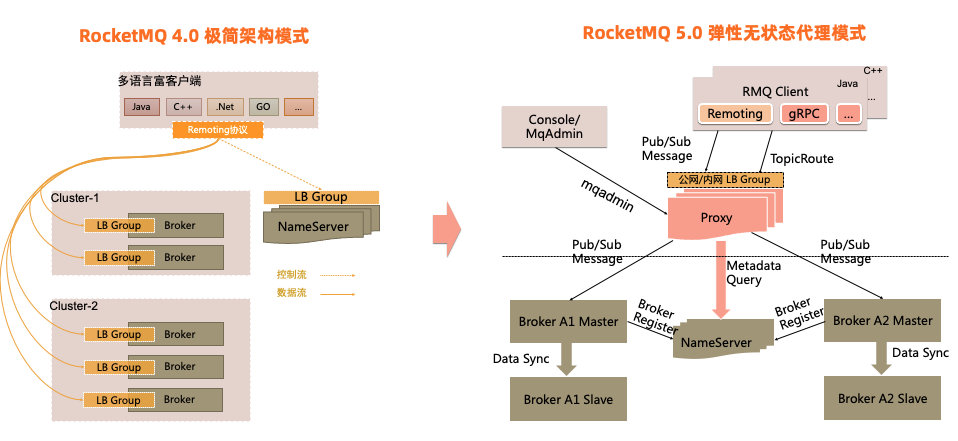

# RocketMQ

## 架构



## 步骤

### 拉取仓库

```shell
git clone https://gitee.com/xinyii/deployment-templates.git
```

如果没有安装 Git，可以使用 Git 一次性容器拉取仓库：

```shell
docker run -it --rm --name git -v "$(pwd)":/home/repo bitnami/git git clone https://gitee.com/xinyii/deployment-templates.git /home/repo/deployment-templates
```

### 创建目录

```shell
mkdir -p /home/rocketmq/namesrv/logs
mkdir -p /home/rocketmq/broker/master/logs
mkdir -p /home/rocketmq/broker/master/store
mkdir -p /home/rocketmq/broker/slave/logs
mkdir -p /home/rocketmq/broker/slave/store
chmod -R a+rw /home/rocketmq
```

### 配置防火墙（host 网络模式）

```shell
firewall-cmd --zone=public --add-port=9876/tcp --permanent
firewall-cmd --zone=public --add-port=10909/tcp --permanent
firewall-cmd --zone=public --add-port=10911/tcp --permanent
firewall-cmd --zone=public --add-port=10912/tcp --permanent
firewall-cmd --zone=public --add-port=10913/tcp --permanent
firewall-cmd --zone=public --add-port=10914/tcp --permanent
firewall-cmd --zone=public --add-port=10919/tcp --permanent
firewall-cmd --zone=public --add-port=10921/tcp --permanent
firewall-cmd --zone=public --add-port=10922/tcp --permanent
firewall-cmd --zone=public --add-port=10923/tcp --permanent
firewall-cmd --zone=public --add-port=10924/tcp --permanent
firewall-cmd --reload
```

### 启动

```shell
docker compose -f rocketmq-cluster.yml up -d
```

## 仪表盘

```shell
docker run -d --name rocketmq-dashboard \
  -e "JAVA_OPTS=-Drocketmq.namesrv.addr=<rocketmq-namesrv-host-1>:9876;<rocketmq-namesrv-host-2>:9876" \
  -p 10908:8080 \
  apacherocketmq/rocketmq-dashboard:latest
```

## 参考

- <https://rocketmq.apache.org/zh/docs/deploymentOperations/01deploy>
- <https://github.com/apache/rocketmq-docker/blob/master/templates/docker-compose/rmq5-docker-compose.yml>
- <https://github.com/apache/rocketmq/tree/main/distribution/conf/2m-2s-async>
